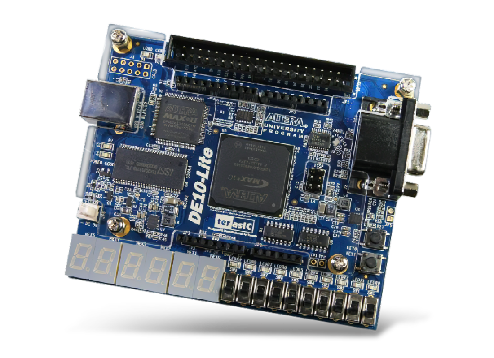
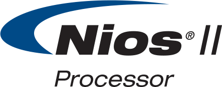
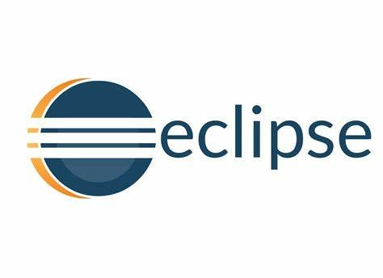

# FPGA Capstone: Building FPGA Projects

This repository contains the projects completed as part of the [**FPGA Capstone: Building FPGA Projects**](https://www.coursera.org/learn/capstone-fpga-design?irclickid=Rxw0RSywnxyKT%3AwQynQ-IWN1UkCyoMWD1xOYyg0&irgwc=1&utm_medium=partners&utm_source=impact&utm_campaign=3526240&utm_content=b2c) course, which is part of the [**FPGA Design for Embedded Systems Specialization**](https://www.coursera.org/specializations/fpga-design) offered on Coursera. The course provided hands-on experience in FPGA design using the **DE10-Lite** development kit and Intel **Quartus Prime** software. The projects cover key aspects of FPGA hardware and software design, including Binary Coded Decimal (BCD) Adders, PWM circuits, ADC circuits, and System-on-Chip (SoC) development using the **NIOS II soft processor**.

## Table of Contents
- [Project 1: Binary Coded Decimal Adder](#project-1-binary-coded-decimal-adder)
- [Project 2: Mixed-Signal System with ADC and PWM](#project-2-mixed-signal-system-with-adc-and-pwm)
- [Project 3: System on a Chip with NIOS II](#project-3-system-on-a-chip-with-nios-ii)
- [Project 4: Software for the NIOS II System](#project-4-software-for-the-nios-ii-system)
- [Hardware & Tools Used](#hardware--tools-used)
- [License](#license)

## Project 1: Binary Coded Decimal Adder
In this project, I designed and tested a **Binary Coded Decimal (BCD) Adder** using the DE10-Lite development board and Quartus Prime software. This project involved setting up the **MAX10** board using the **System Builder** tool and recording all the observations in a lab notebook.

## Project 2: Mixed-Signal System with ADC and PWM
In this project, I designed a mixed-signal system that measures voltage using the Analog-to-Digital Converter (ADC) and controls an output using a **Pulse Width Modulation (PWM)** circuit. Quartus Prime's built-in tools were used for simulation and verification.

## Project 3: System on a Chip with NIOS II
In this project, I developed the hardware for a **System on a Chip (SoC)** using the NIOS II soft processor. The system was created using **Qsys (Platform Designer)** to integrate multiple interfaces on the DE10-Lite board. The design was compiled and instantiated into a top-level HDL file.

## Project 4: Software for the NIOS II System
In this project, I developed software for the **NIOS II soft processor** using **NIOS II Software Build Tools (SBT) for Eclipse**. The software was designed to interface with the hardware created in Project 3, and both the hardware and software were programmed into the FPGA for testing.

## Hardware & Tools Used

- **DE10-Lite Development Kit** with **Intel MAX10** FPGA
- **Quartus Prime** Design Software
- **Qsys (Platform Designer)** for SoC creation
- **NIOS II Software Build Tools (SBT)** for embedded software development
- **Eclipse IDE** for C programming

  
  
  
  

